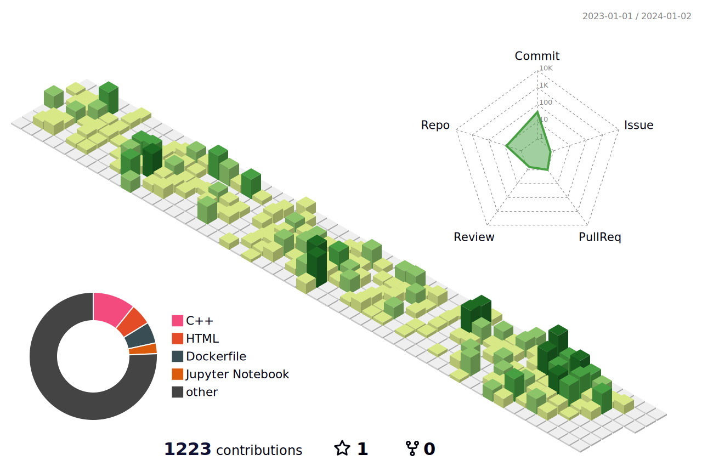

<h1 align="center">Hi, I'm Andrew Gigena</h1>
<h3 align="center">A backend developer from Montevideo, Uruguay!</h3>

  

    <h4 align="center">My favorite technologies:</h4>
    

        <!-- Programming languages -->
        
        
        
        <!-- Python centric -->
        
        
        
        
        
        
    

    

        <!-- Cloud -->
        
        
        
        <!-- Databases -->
        
        
        
        
        
        <!-- Operative Systems -->
        
            
    

<h4 align="center">My work this year:</h4>

    

